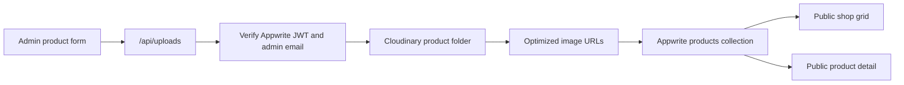

# Phase 3 Product Management

## Scope

Phase 3 connects product management to Appwrite Databases and Cloudinary. It intentionally does not change the customer storefront layout, animation system, product card design, routes, or filter behavior.

## Appwrite Collection

Create one Appwrite database collection for products.

- Database ID: value of `VITE_APPWRITE_DATABASE_ID`
- Collection ID: `products` or value of `VITE_APPWRITE_PRODUCTS_COLLECTION_ID`
- Collection permissions: no direct public permissions; product reads and admin writes go through the server API using `APPWRITE_API_KEY`
- Setup command: `npm run setup:appwrite:products`
- Required indexes:
  - `status`
  - `visible`
  - `category`
  - `slug`
  - `createdAt`
  - `updatedAt`

### Attributes

| Attribute     | Type            | Required | Notes                                                      |
| ------------- | --------------- | -------- | ---------------------------------------------------------- |
| `productId`   | string          | yes      | Stable product identifier.                                 |
| `slug`        | string          | yes      | Used in `/products/$productId`.                            |
| `name`        | string          | yes      | Product display name.                                      |
| `category`    | enum/string     | yes      | `Jewellery`, `Footwear`, `Dresses`, `Bags`, `Accessories`. |
| `subcategory` | string          | yes      | Category-specific subcategory.                             |
| `description` | string          | yes      | Product detail copy.                                       |
| `price`       | float           | yes      | Current GH₵ price.                                         |
| `oldPrice`    | float           | no       | Optional previous price.                                   |
| `stock`       | integer         | yes      | Stock count.                                               |
| `images`      | string array    | yes      | Cloudinary secure/optimized image URLs.                    |
| `sizes`       | string array    | no       | Comma-entered sizes saved as an array.                     |
| `colors`      | string array    | no       | Comma-entered colors saved as an array.                    |
| `featured`    | boolean         | yes      | Admin-controlled merchandising flag.                       |
| `trending`    | boolean         | yes      | Admin-controlled trending flag.                            |
| `visible`     | boolean         | yes      | Hidden products do not render publicly.                    |
| `status`      | enum/string     | yes      | `draft`, `published`, `archived`.                          |
| `createdAt`   | datetime/string | yes      | Product creation timestamp.                                |
| `updatedAt`   | datetime/string | yes      | Last product update timestamp.                             |

## Cloudinary

The admin form accepts image files directly. Files are uploaded to `/api/uploads`, the API validates the current Appwrite session JWT against the configured admin email allowlist, Cloudinary stores the assets under `rannys-clothing/products`, and only the returned Cloudinary URLs are saved to Appwrite.

## Product Flow

## Phase 4 Remaining

- Orders and checkout lifecycle
- Inventory rules beyond simple stock count
- Customers and customer segmentation
- Messages and subscriber workflows
- Promotions and homepage campaign manager
- Analytics and reporting
