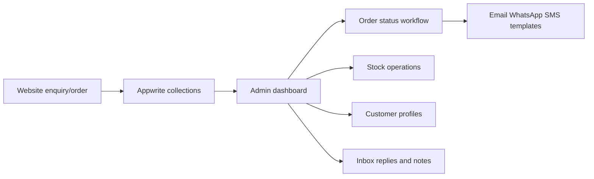

# Phase 4 Operations

## Scope

Phase 4 implements order management, inventory management, customer management, customer communication, dashboard notifications, global admin search, and CSV exports. It does not implement homepage manager, promotions, analytics charts, or marketing campaigns.

## Appwrite Collections

Use the same Appwrite database as products.

- `orders`
- `customers`
- `messages`
- `subscribers`

Admin reads/writes run through `/api/admin/operations/*` and require an Appwrite JWT that matches `ADMIN_EMAILS`. Website enquiries can be submitted to `/api/messages` and are stored in the `messages` collection as `new` and `unread`.

## Required Fields

### Orders

- `orderNumber`, `customerName`, `phone`, `email`, `deliveryAddress`
- `items` as JSON string
- `subtotal`, `shipping`, `discount`, `total`
- `paymentMethod`, `paymentStatus`, `orderStatus`
- `notes`, `statusHistory` as JSON string
- `createdAt`, `updatedAt`

### Customers

- `profile`, `name`, `phone`, `email`
- `orders`, `totalSpent`
- `addresses` as JSON string
- `wishlist` as JSON string
- `status`, `activityTimeline` as JSON string
- `dateJoined`, `updatedAt`

### Messages

- `name`, `email`, `phone`, `subject`, `body`
- `status`, `internalNotes`, `replies` as JSON string
- `unread`, `createdAt`, `updatedAt`

## Operational Flow

